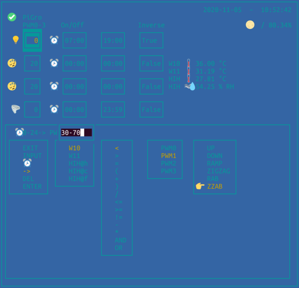

# PiGro #

hotkeys:

- 's' : save config
- SPACE : update
- 'r' : redraw
- 'q' : quit
- '1'-'4' : maintenance mode for PWM0-3
- cursor left/right : next/previos widget
- cursor up/down : change value/cursor position
- 'a' shows add-rules dialog
- 'e' shows edit-rules selector
- 'x' exports rules to file 'rules.yaml'
- 'i' imports rules from file 'rules.yaml'

## PiGro allows you to: ##

- read thermal & humidity sensors
- control pwm driven fans and led drives
- maintenance mode for better eye protection from strong light sources
- automatically turn the light on and off
- automatically change power of led and out fan upon sensor values
- keep track of the moonphase
- GUI can be changed corresponding to your hardware setup

## Hardware setup: ##
(This is my setup, you only need the Raspberry Pi and the PCA9685 PWM HAT for testing)
- Raspberry Pi ZeroW (any RaspberryPi will work)
- PWM servo driver hat PCA9685
- DS18B20 thermo sensor (Maxim Integrated)
- HIH7121 humidity/thermo sensor (Honeywell, for high humidity scenarios)
- optional: DHT-xx/AM230x (only for external measurements - NOT for high humidity scenarios)
- ELG-240-42AB led driver (Meanwell)
- Zeus compact led board 2x (Led-Tech)
- Bitfenix 200mm fan for cooling the led boards
- optional: converter [MOSFET IRF520+1kΩ resistor] for 5v pwm to 0-10v for non-pwm fans or Meanwell drivers 
  (so you can achive 0-100% light intensity, without only 0-50% is possible (but with better lm/w ratio and cooling)
- Noctua PWM fan for outgoing air

## Installation: ##

** CAUTION ** Only connect the led driver if you have the qualification to do so!
Be careful with your fingers/hair with 12v fans!
DON'T use cables with loose connectors for pwm connections to the led-driver (Meanwell) or fans!
** NO PWM SIGNAL TO THE MEANWELL DRIVER RESULTS IN LED LIGHTS RUNNING AT 100% POWER! **

The led driver is controlled via **PWM0**.
The outgoing air fan is controlled via **PWM3**.
(see image above)

OneWire/DS18B20: **GPIO4**
add the following to your raspberry pi's `/boot/config.txt`:
`dtoverlay=w1-gpio,gpiopin=4`

HIH7121
connect it to i2c1

## Enabling the interfaces ##
`sudo raspi-config`
-> `Interfacing-Options` -> enable `I2C`, enable `1-Wire`

## Getting your Raspberry Pi ready ##

`sudo apt install python3 python3-{pip,dev,libgpiod,smbus}`

`git clone https://github.com/dawigit/pigro.git`

`cd pigro`

`python3 -m pip install -r requirements.txt`

Don't forget to add your user to 'i2c' group

`sudo usermod -a -G i2c pi`

Start pigro

`python3 pigro.py` 

Start with pwm0 reranged (0-80) & reversed (inverse) signal

`python3 pigro.py -rere` 

Start without showing moon

`python3 pigro.py -nomoon`

